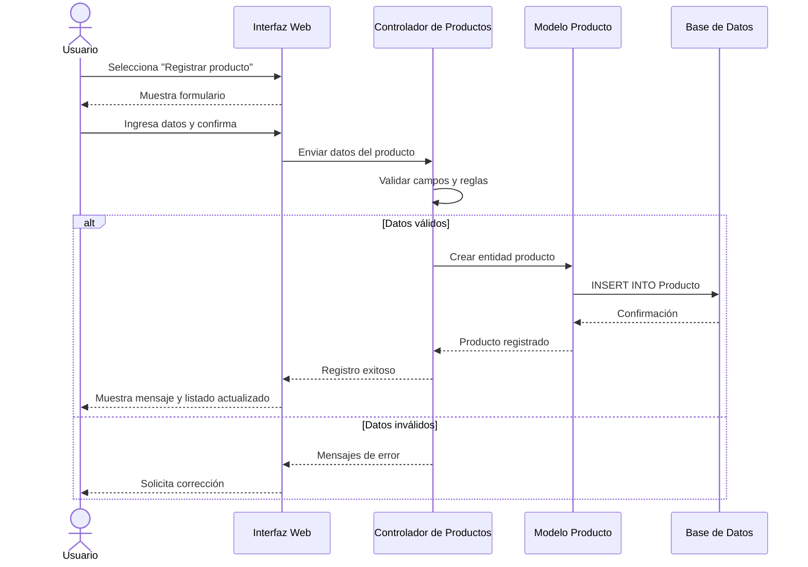
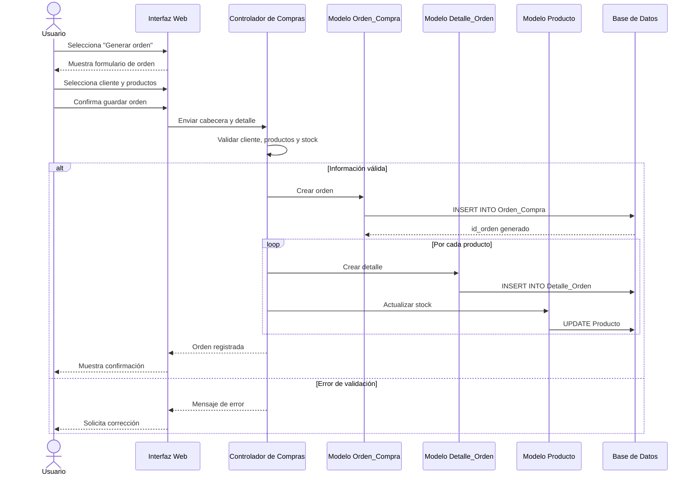
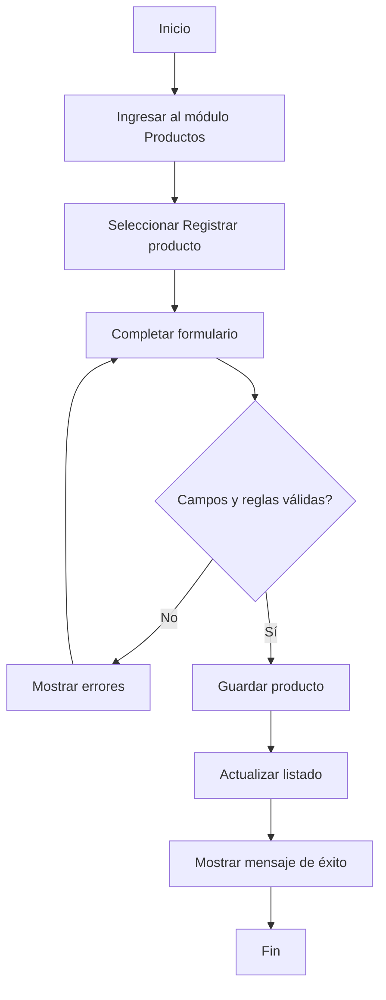
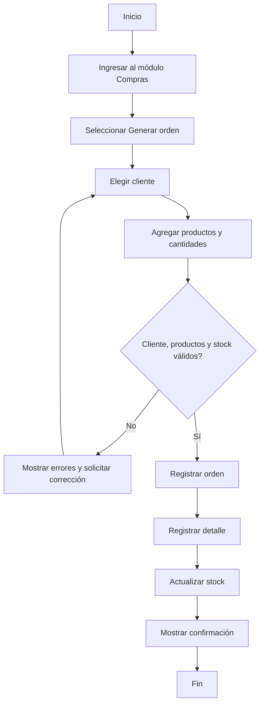

# Laboratorio: Casos de Uso y Diagramas

Fecha de elaboración: 10/03/2026

## Supuesto de modelado

En el esquema actual del proyecto, la tabla `Orden_Compra` se relaciona con `Cliente`, `Usuario` y `Detalle_Orden`. Por eso, este entregable describe la "orden de compra" según la estructura implementada en el sistema actual.

## Caso de Uso 01

Prototipo: Sistema de gestión comercial  
Número Caso de Uso: 01  
Módulo: Producto (Inserción)  
Fecha elaboración: 10/03/2026  
Descripción Caso de Uso: El presente caso de uso muestra la forma en la que un usuario autorizado registra un nuevo producto en el sistema, indicando su nombre, precio, stock inicial y, de manera opcional, la campaña asociada.  
Autor caso de uso: Equipo G5.  
Actores relacionados: Usuario administrador, usuario de inventario.

### Precondiciones

- El usuario debe estar registrado en la base de datos.
- El usuario debe iniciar sesión en el sistema.
- El usuario debe poseer permisos para administrar productos.
- Si el producto se asociará a una campaña, dicha campaña debe existir previamente.

### Flujo Básico del caso de uso

1. El usuario selecciona la opción `Mantenimientos` del menú principal.
2. El sistema muestra las opciones de administración disponibles.
3. El usuario selecciona la opción `Productos`.
4. El sistema muestra el listado de productos registrados y la opción `Registrar producto`.
5. El usuario da clic en `Registrar producto`.
6. El sistema muestra el formulario de inserción de producto con los campos: nombre, precio actual, stock e identificación de campaña opcional.
7. El usuario ingresa la información requerida del producto.
8. El usuario da clic en el botón `Guardar producto`.
9. El sistema ejecuta el subflujo `SF-01 Registrar producto`.
10. Fin del caso de uso.

### Sub-Flujos

#### SF-01 Registrar producto

- El sistema valida que los campos obligatorios hayan sido completados. `FA-01 Confirmación de campos`
- El sistema valida que el precio sea mayor que cero y que el stock no sea negativo. `FA-02 Validación de reglas del producto`
- Si se indicó campaña, el sistema valida que exista en la base de datos. `FA-03 Validación de campaña`
- El sistema guarda el nuevo producto en la tabla `Producto`.
- El sistema redirecciona al usuario al listado de productos.
- El sistema muestra el nuevo producto dentro de la tabla.
- El sistema presenta un mensaje en pantalla indicando que el registro fue exitoso.

### Flujos Alternos

#### FA-01 Confirmación de campos

- Si uno o más campos obligatorios están vacíos, el sistema muestra un mensaje indicando que debe completar la información requerida y no permite continuar hasta corregirla.

#### FA-02 Validación de reglas del producto

- Si el precio ingresado es menor o igual a cero, el sistema muestra un mensaje de error y solicita un valor válido.
- Si el stock ingresado es menor que cero, el sistema muestra un mensaje de error y solicita un valor válido.

#### FA-03 Validación de campaña

- Si el identificador de campaña ingresado no existe o no es válido, el sistema muestra un mensaje de error y no registra el producto hasta corregir la información.

### Postcondiciones

- El sistema almacena el nuevo producto en la base de datos.
- El listado de productos queda actualizado con el nuevo registro.

## Caso de Uso 02

Prototipo: Sistema de gestión comercial  
Número Caso de Uso: 02  
Módulo: Compras (Generación de orden de compra)  
Fecha elaboración: 10/03/2026  
Descripción Caso de Uso: El presente caso de uso muestra la forma en la que un usuario genera una orden de compra en el sistema, asociando un cliente, uno o varios productos, cantidades y estado inicial de la orden.  
Autor caso de uso: Equipo G5.  
Actores relacionados: Usuario vendedor, usuario administrador.

### Precondiciones

- El usuario debe estar registrado en la base de datos.
- El usuario debe iniciar sesión en el sistema.
- El usuario debe poseer permisos para registrar órdenes.
- El cliente debe existir previamente en la base de datos.
- Los productos seleccionados deben existir y contar con disponibilidad suficiente.

### Flujo Básico del caso de uso

1. El usuario selecciona la opción `Compras` o `Órdenes` en el menú principal.
2. El sistema muestra el listado de órdenes registradas y la opción `Generar orden de compra`.
3. El usuario da clic en `Generar orden de compra`.
4. El sistema muestra el formulario para registrar la orden con los datos de cliente, usuario responsable y detalle de productos.
5. El usuario selecciona al cliente.
6. El sistema carga la información del cliente seleccionado.
7. El usuario agrega uno o varios productos al detalle de la orden.
8. El usuario indica la cantidad requerida para cada producto.
9. El sistema calcula el precio de venta por línea y el total estimado de la orden.
10. El usuario confirma la información y da clic en `Guardar orden`.
11. El sistema ejecuta el subflujo `SF-01 Registrar orden de compra`.
12. Fin del caso de uso.

### Sub-Flujos

#### SF-01 Registrar orden de compra

- El sistema valida la información general de la orden. `FA-01 Confirmación de campos`
- El sistema valida que el cliente exista y esté habilitado. `FA-02 Validación de cliente`
- El sistema valida que todos los productos seleccionados existan. `FA-03 Validación de productos`
- El sistema valida que las cantidades solicitadas no excedan el stock disponible. `FA-04 Validación de inventario`
- El sistema crea el registro principal en la tabla `Orden_Compra` con estado inicial `Pendiente`.
- El sistema registra cada línea de detalle en la tabla `Detalle_Orden`.
- El sistema actualiza el stock de los productos involucrados.
- El sistema redirecciona al usuario al listado o detalle de la orden generada.
- El sistema muestra un mensaje de confirmación indicando que la orden fue creada exitosamente.

### Flujos Alternos

#### FA-01 Confirmación de campos

- Si falta información obligatoria en la cabecera de la orden o en alguna línea del detalle, el sistema muestra un mensaje de error y no permite guardar la orden.

#### FA-02 Validación de cliente

- Si el cliente no existe, está inactivo o no puede ser asociado a la orden, el sistema muestra un mensaje en pantalla y solicita seleccionar otro cliente.

#### FA-03 Validación de productos

- Si un producto no existe o no se encuentra disponible para la venta, el sistema muestra un mensaje en pantalla y no permite registrar la orden hasta corregir el detalle.

#### FA-04 Validación de inventario

- Si la cantidad solicitada para uno o más productos supera el stock disponible, el sistema muestra un mensaje de error, identifica el producto afectado y solicita ajustar la cantidad.

### Postcondiciones

- El sistema registra la orden de compra con estado `Pendiente`.
- El sistema registra el detalle de productos asociados a la orden.
- El inventario queda actualizado conforme a las cantidades aprobadas.

## Diagrama de Secuencia

### Inserción de producto

### Generación de orden de compra

## Diagrama de Actividades

### Inserción de producto

### Generación de orden de compra

